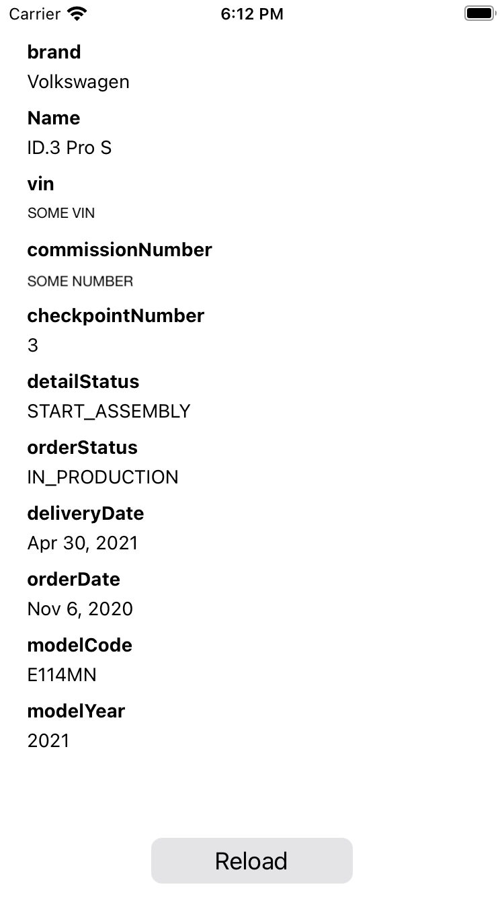

# iOS-Volkswagen-Vehicle-Production-State

After entering your commission number in your Volkswagen account, you can get the production state and delivery date via the Volkswagen API.
This iOS app makes it a bit easier to fetch the current state from the API. 
Build and run via Xcode. 

# How To 
1. Have a Mac
2. Install Xcode via Mac App Store
4. Build the App for your connected phone (You must have an Apple Developer Account to sign the app for your phone)
5. Launch the App
6. Log in with your Volkswagen account (when the Login WebView comes up)

# Example

# Next
Background updates and notifications when state has been changed 

Inspired by: https://www.goingelectric.de/forum/viewtopic.php?f=393&t=60974
